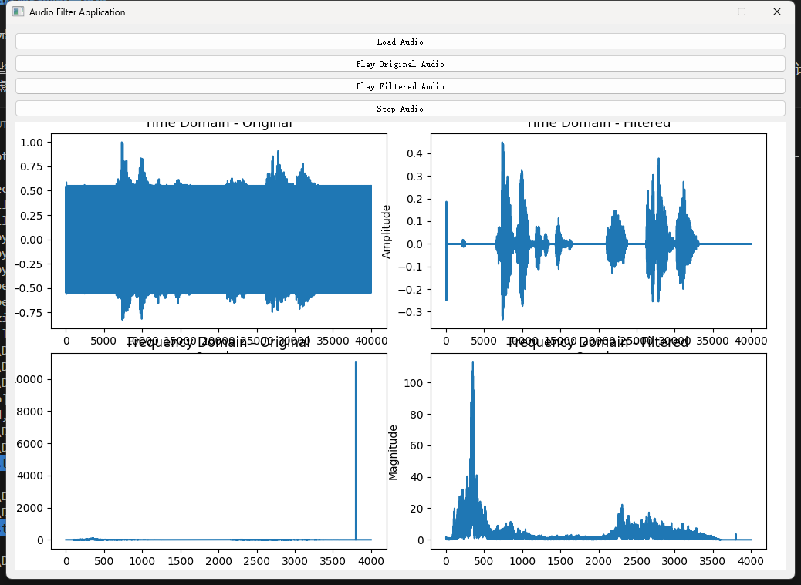
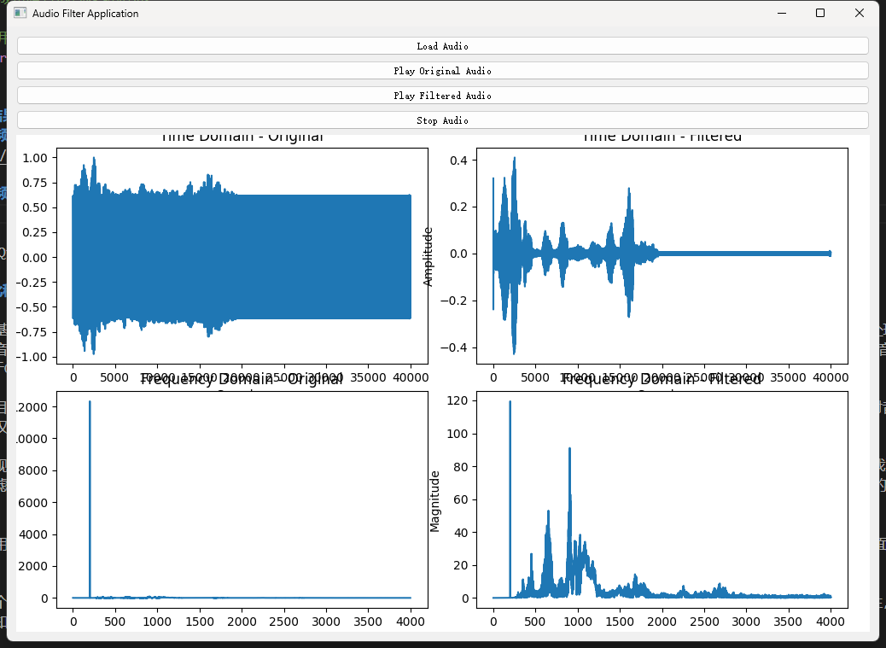
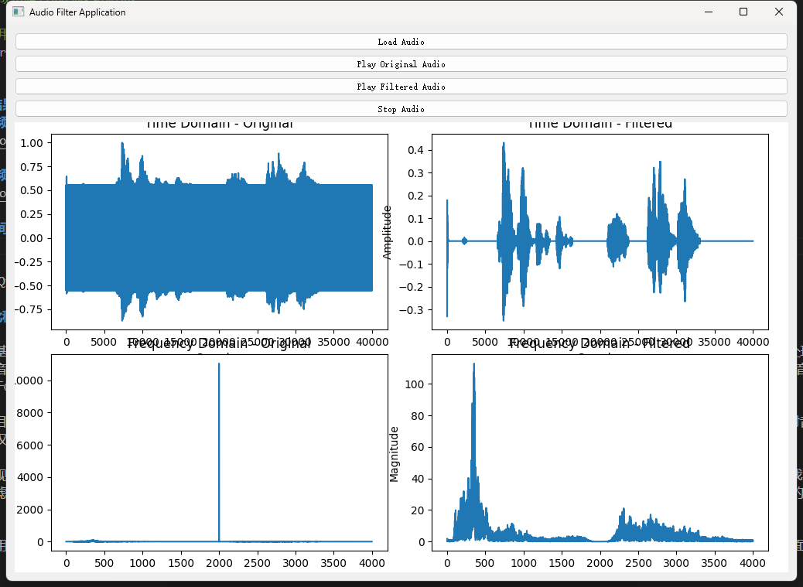
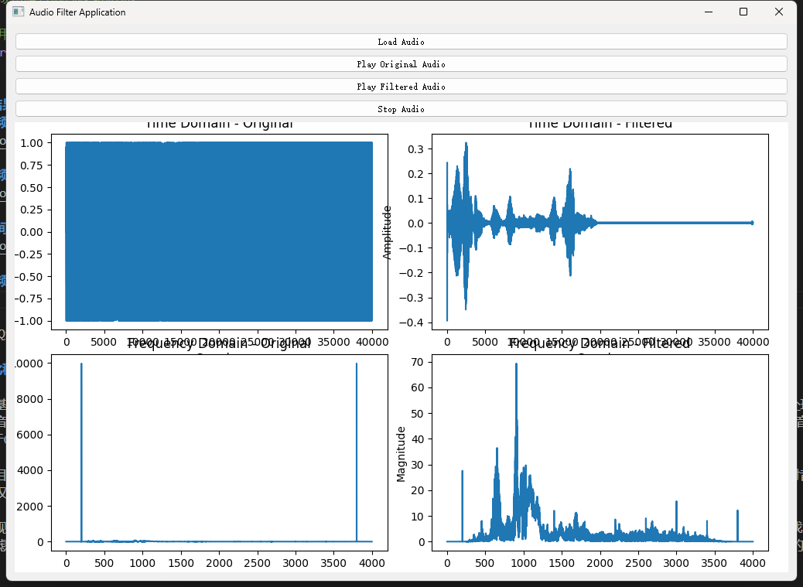

# 设计要求

## 1.1 设计题目:
**应用Python进行数字信号分析以及滤波器设计**

## 1.2 设计目的:
数字信号处理（DSP）是从 20 世纪 60 年代以来，随着信息学科和计算机学科的高速发展而迅速发展起来的一门新兴学科，是通信工程专业一门重要的理论基础课程。信号处理算法与实现课程设计是在学习完数字信号处理的相关理论后，进行的综合性训练项目，其目的是:
1. 使学生进一步巩固数字信号处理的基本概念、理论、分析方法和实现方法； 
2. 增强学生运用 Python 软件编写数字信号处理的应用程序及分析、解决实际问题的能力。

## 1.3 设计内容和要求:
为了巩固所学的数字信号处理理论知识，使学生对信号的存储、时频域分析、图形显示以及数字滤波等有系统性的掌握和理解，安排了以下的课程设计内容：   
针对噪声干扰的语音信号，首先利用 python 函数试听语音信号的内容，接着通过编写程序分析语音信号时域波形和功率谱波形。按照给定要求，分别设计 IIR和 FIR 数字滤波器，并分析滤波器的幅度响应、相位响应，群延迟响应以及零极点位置。然后用设计好的滤波器对存在噪声干扰的语音信号进行滤波，分析滤波点位置。然后用设计好的滤波器对存在噪声干扰的语音信号进行滤波，分析滤波后语音信号的时域波形和功率谱波形，并对滤波前后的信号进行对比，分析信号的变化；回放语音信号，检验噪声干扰是否消除；最后，利用 PYQT 设计一个信号处理系统界面。下面对各步骤加以具体说明。 

1. 提取噪声干扰的语音信号，播放其内容   
给定了4段噪声干扰的语音信号（见附件说明），要求学生提取语言信号的数据，并用特定函数播放其内容。   
2. 噪声干扰的语音信号的时域和频域分析   
语音信号是非平稳的随机过程，频率会随着时间而变化。在语音信号处理研究领域，通常用短时间的傅里叶变换（STFT）来分析其时域和频率特性，也就是在 20ms~50ms 以内，可以将语音信号看成是平稳的随机过程。平稳的随机过程是功率信号，可以用功率谱来描述。所加的噪声干扰是单音干扰，单音干扰是周期信号。    
要求学生首先画出噪声干扰的语音信号时域波形；然后画出语音信号的功率谱波形，从而加深学生对信号时域和频域特性的理解。   
提示：这里提取了 20ms 的语音信号来分析其时域和功率谱特性，由于采样频率是 8000Hz，因此我们利用了 160 个采样点，起始点在第 10001 点，结束点在第 10160 点。   
3. 设计数字滤波器和画出其频率响应   
要求学生分别设计无限长单位冲激响应（IIR）和有限长单位冲激响应（FIR）的低通、高通、带通和带阻数字滤波器。   
IIR 滤波器的设计方法:
模拟滤波器设计法。首先设计模拟低通原型滤波器（巴特沃斯滤波器、切比雪夫滤波器、椭圆形滤波器），然后利用双线性变换法转化成数字滤波器。   
FIR 滤波器的设计方法:
窗函数设计法。利用不同的窗函数（矩形窗，巴特列特，汉宁窗，海明窗，布拉克曼窗，凯泽窗）来设计 FIR 数字滤波器。   
分析滤波器的幅度响应、相位响应、零极点分布以及群延迟。   
4. 用数字滤波器对信号进行滤波   
要求学生用设计好的数字滤波器对噪声干扰的语音信号进行数字滤波。   
5. 比较滤波前后语音信号的波形及频谱   
要求学生在一个窗口同时画出滤波前后的时域波形及频域波形。   
6. 回放语音信号   
利用特定函数回放经过数字滤波器滤波之后的语音信号，检验噪声是否已经滤除，如无法滤除，重新设计滤波器的参数，直到噪声完全消除。   
7. 设计系统界面   
为了使编制的程序操作方便，要求学生设计简洁的用户界面。在所设计的用户界面上可以选择滤波器的响应类型，如低通，高通；可以选择滤波器的设计方法，如 IIR 和 FIR，其中 IIR 下又可选 butter，chebyI,  chebyII 和 ellip，FIR 可根据输入的参数，选择不同的窗函数。 


# 系统分析和设计

## 程序架构

### 主要组件

1. **AudioFilterApp (`main.py`)**
   - 基于`QWidget`的GUI应用程序。
   - 包含用于加载音频、播放原始音频和过滤音频以及停止播放音频的按钮。
   - 使用`matplotlib`集成在`PyQt5`中来显示音频数据及其过滤版本的图形。
   - 处理UI设置、绘图初始化和基于音频数据更新绘图的函数。

2. **AudioPlayer (`audio_player.py`)**
   - 使用`sounddevice`处理音频文件的加载、播放和停止。
   - 使用`scipy.io.wavfile`读取音频文件。
   - 根据文件名的提示使用`audio_filters`模块中预定义的滤波器来过滤音频。
   - 加载新音频数据后通过回调函数更新GUI应用程序的绘图。

3. **Audio Filters (`audio_filters.py`)**
   - 包含使用`scipy.signal`应用低通、高通、带通和带阻滤波器的函数。
   - 每个滤波器函数生成所需的系数，并将其应用于输入数据。

### 功能详解

- **加载音频**：应用程序可以加载WAV文件，并根据文件名决定应用哪种类型的滤波器，可能是低通、高通、带通或带阻滤波器。
- **播放音频**：用户可以听原始或过滤后的音频。
- **可视化**：加载音频文件后，应用程序更新四个子图：
  1. 原始音频的时间域表示。
  2. 过滤音频的时间域表示。
  3. 原始音频的频率域表示（幅度谱）。
  4. 过滤音频的频率域表示。

## 各种滤波器的实现原理及数学公式

### 1. 低通滤波器

低通滤波器的目的是允许频率低于截止频率的信号通过，同时抑制高于截止频率的信号。在数字信号处理中，低通滤波器通常使用有限脉冲响应（FIR）滤波器来实现。

**FIR滤波器的数学表示**:
$$y[n] = \sum_{k=0}^{M-1} h[k] \cdot x[n-k]$$
其中:
- $y[n]$ 是输出信号
- $x[n]$ 是输入信号
- $h[k]$ 是滤波器系数
- $M$ 是滤波器的长度

FIR滤波器系数 $$h[k]$$ 可以使用窗函数法生成，其中一个常见的选择是汉宁窗。

**滤波器实现代码**
```python
def apply_lowpass_filter(data, samplerate, cutoff_hz=3500.0, numtaps=101):
    # 生成低通FIR滤波器的系数
    fir_coeff = firwin(numtaps, cutoff_hz, fs=samplerate)
    # 应用滤波器
    return lfilter(fir_coeff, [1.0], data)
```

### 2. 高通滤波器

高通滤波器的目的是允许频率高于截止频率的信号通过，同时抑制低于截止频率的信号。它通常使用无限脉冲响应（IIR）滤波器来实现。

**IIR滤波器的数学表示**:
$$y[n] = \sum_{k=0}^{N} b[k] \cdot x[n-k] - \sum_{k=1}^{M} a[k] \cdot y[n-k]$$
其中:
- $y[n]$ 是输出信号
- $x[n]$ 是输入信号
- $b[k]$ 是前向滤波器系数
- $a[k]$ 是反馈滤波器系数
- $N$ 和 $M$ 是滤波器的阶数

**滤波器实现代码**
```python
def apply_highpass_filter(data, samplerate, cutoff_hz=500.0, order=5):
    # 生成高通IIR滤波器的系数
    b, a = iirfilter(order, cutoff_hz, btype='high', ftype='butter', fs=samplerate)
    # 应用滤波器
    return lfilter(b, a, data)
```

### 3. 带通滤波器

带通滤波器允许在特定频率范围内的信号通过，同时阻止低于和高于此范围的频率的信号。带通滤波器通常是通过将高通和低通滤波器的特性结合起来实现的。

**IIR带通滤波器的数学表示**:
$$y[n] = \sum_{k=0}^{N} b[k] \cdot x[n-k] - \sum_{k=1}^{M} a[k] \cdot y[n-k]$$
这里的系数 $$b[k]$$ 和 $$a[k]$$ 需要设计来允许特定的低截止频率 $$f_L$$ 和高截止频率 $$f_H$$ 之间的频率通过。

**滤波器实现代码**
```python
def apply_bandpass_filter(data, samplerate, low_cutoff_hz=600.0, high_cutoff_hz=3300.0, order=5):
    # 生成带通IIR滤波器的系数
    b, a = iirfilter(order, [low_cutoff_hz, high_cutoff_hz], btype='band', ftype='butter', fs=samplerate)
    # 应用滤波器
    return lfilter(b, a, data)
```
### 4. 带阻滤波器

带阻滤波器的目的是阻止在特定频率范围内的信号通过，同时允许其他频率的信号。这可以通过结合高通和低通滤波器的特性来实现反向效果。

**IIR带阻滤波器的数学表示**:
$$y[n] = \sum_{k=0}^{N} b[k] \cdot x[n-k] - \sum_{k=1}^{M} a[k] \cdot y[n-k]$$
在这种情况下，滤波器的设计需要精确地阻止 $$f_L$$ 和 $$f_H$$ 之间的频率。

在实现这些滤波器时，设计合适的系数 $$b[k]$$ 和 $$a[k]$$ 是关键，通常需要利用滤波器设计软件或专门的函数库如 `scipy.signal` 来辅助计算这些系数，确保滤波器满足给定的性能规格。

**滤波器实现代码**
```python
def apply_bandstop_filter(data, samplerate, low_cutoff_hz=1800.0, high_cutoff_hz=2200.0, order=5):
    # 生成带阻IIR滤波器的系数
    b, a = iirfilter(order, [low_cutoff_hz, high_cutoff_hz], btype='bandstop', ftype='butter', fs=samplerate)
    # 应用滤波器
    return lfilter(b, a, data)
```

## 设计结果分析
**滤除高频干扰(低通滤波)**  
  

**滤除低频干扰(高通滤波)**
  

**滤除中间频率干扰(带阻滤波器)**  
  

**滤除高频和低频干扰(带通滤波器)**


此PythonQt程序可以成功滤除音频内的高频干扰,低频干扰和中间频率干扰.  

## 设计此程序的心得体会

设计一个基于Python和PyQt5的音频过滤及可视化应用程序是一个既充满挑战又极具教育意义的经历。首先，从技术角度来看，这个项目涉及到音频处理的多个层面，包括音频的加载、处理、播放以及通过图形用户界面（GUI）的交互实现。使用Python作为开发语言的优势在于其丰富的库资源，比如scipy用于音频处理，PyQt5用于GUI开发，以及matplotlib用于数据可视化，这些都极大地简化了开发过程。

在这个项目中，我学习到了如何处理和可视化音频数据。通过实时更新图形界面显示音频信号的时间域和频率域图像，使用户能够直观地看到滤波器对音频信号的影响。这不仅提高了用户体验，也加深了用户对音频信号处理理论的理解。

此外，实现四种基本的数字滤波器——低通、高通、带通和带阻——并将它们应用于音频信号，需要深入理解数字信号处理的基本原理。通过动手实践，我更加深刻地理解了各种滤波器设计的理论和实际应用。例如，设计FIR和IIR滤波器不仅需要选择合适的滤波器参数，如截止频率和滤波器阶数，还需要考虑到实现的复杂性和运算效率。

在项目的用户界面设计方面，PyQt5提供了强大的工具和组件，使得创建现代化和功能丰富的GUI成为可能。通过这个项目，我学到了如何合理布局界面，使用户操作直观便捷，并确保应用程序的响应性和效率。

总之，这个项目不仅加深了我对音频处理技术的理解，还提升了我的编程技能和软件工程知识。通过这次经历，我更加确认了持续学习新技术的重要性，并且体会到了将理论知识应用于解决实际问题的成就感。这些经验对我未来在软件开发和数据处理领域的职业生涯将是极其宝贵的资产。

## 参考文献

1. **Summerfield, Mark. (2018). *Rapid GUI Programming with Python and Qt: The Definitive Guide to PyQt Programming*. Prentice Hall.**
   - 本书详细介绍了PyQt编程，适合想要深入了解如何使用PyQt构建GUI应用的开发者。

2. **Oppenheim, Alan V., & Schafer, Ronald W. (2009). *Discrete-Time Signal Processing*. Prentice Hall.**
   - 这本书是数字信号处理领域的经典教材，详细介绍了各种数字滤波器的设计和实现，对理解音频处理有重要帮助。

3. **Virtanen, Pauli, Gommers, Ralf, Oliphant, Travis E., et al. (2020). SciPy 1.0: Fundamental Algorithms for Scientific Computing in Python. *Nature Methods*.**
   - 这篇论文描述了SciPy库的开发和功能，SciPy是Python中用于科学计算的核心库之一，包含了广泛的信号处理模块。

4. **McKinney, Wes. (2017). *Python for Data Analysis*. O'Reilly Media.**
   - 虽然主要关注数据分析，但本书对于学习使用Python进行数据操作和可视化非常有用，特别是涉及到处理和分析音频数据时。

5. **Beylkin, Gregory. (1995). On the Representation of Operators in Bases of Compactly Supported Wavelets. *SIAM Journal on Numerical Analysis*.**
   - 这篇文章讨论了在紧支撑小波基中表示算子的方法，这对于理解如何在Python中处理音频信号的压缩和滤波非常有用。